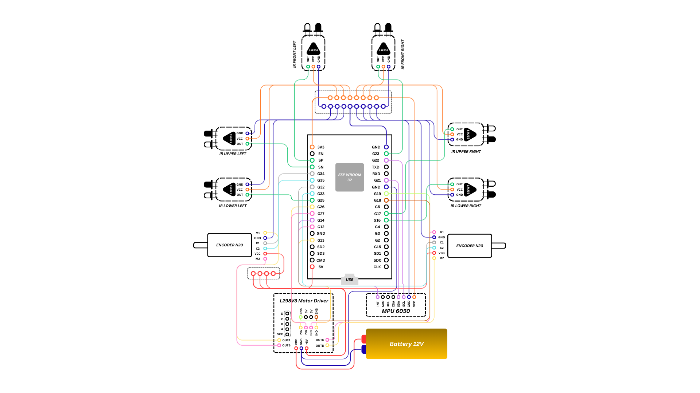

# List of components

## Encoders w/ motors
- Encoder 1 (left): 3 pin & 2 power pins
    |Pin|GPIO|Note|
    |:--|:-:|:-:|
    |VCC|5V|Highest posible|
    |GND|GND|Connect w/ others|
    |M1|OUTA|Driver's GPIO|
    |M2|OUTB|Driver's GPIO|
    |C1|G34||
    |C2|G35||

- Encoder 2 (right): 3 pin & 2 power pins
    |Pin|GPIO|Note|
    |:--|:-:|:-:|
    |VCC|5V|Highest posible|
    |GND|GND|Connect w/ others|
    |M1|OUTC|Driver's GPIO|
    |M2|OUTD|Driver's GPIO|
    |C1|G32||
    |C2|G33||

## Motor Driver L298V3
|Pin|GPIO|Note|
|:--|:-:|:-:|
|ENA|G18||
|ENB|G19||
|INA|G26|OUTA Connected|
|INB|G27|OUTB Connected|
|INC|G12|OUTC Connected|
|IND|G13|OUTD Connected|
|VDD|Battery's (+)||
|GND|Battery's (-) & GND||
|+5V|5V||

## MPU6050
|Pin|GPIO|Note|
|:--|:-:|:-:|
|VCC|3V3|Connect w/ others|
|GND|GND|Connect w/ others|
|SCL|G22|Can't be change|
|SDA|G21|Can't be change|
|INT|G14||

## IR Sensors
- IR Front Left: 1 pin & 2 power pins
    |Pin|GPIO|Note|
    |:--|:-:|:-:|
    |VCC|3V3|Connect w/ others|
    |GND|GND|Connect w/ others|
    |OUT|G36|GPIO SP|
- IR Front Right: 1 pin & 2 power pins
    |Pin|GPIO|Note|
    |:--|:-:|:-:|
    |VCC|3V3|Connect w/ others|
    |GND|GND|Connect w/ others|
    |OUT|G23||
- IR Upper Left: 1 pin & 2 power pins
    |Pin|GPIO|Note|
    |:--|:-:|:-:|
    |VCC|3V3|Connect w/ others|
    |GND|GND|Connect w/ others|
    |OUT|G39|GPIO SN|
- IR Lower Left: 1 pin & 2 power pins
    |Pin|GPIO|Note|
    |:--|:-:|:-:|
    |VCC|3V3|Connect w/ others|
    |GND|GND|Connect w/ others|
    |OUT|G25||
- IR Upper Right: 1 pin & 2 power pins
    |Pin|GPIO|Note|
    |:--|:-:|:-:|
    |VCC|3V3|Connect w/ others|
    |GND|GND|Connect w/ others|
    |OUT|G17||
- IR Lower Right: 1 pin & 2 power pins
    |Pin|GPIO|Note|
    |:--|:-:|:-:|
    |VCC|3V3|Connect w/ others|
    |GND|GND|Connect w/ others|
    |OUT|G16||

## Micromouse Interface
